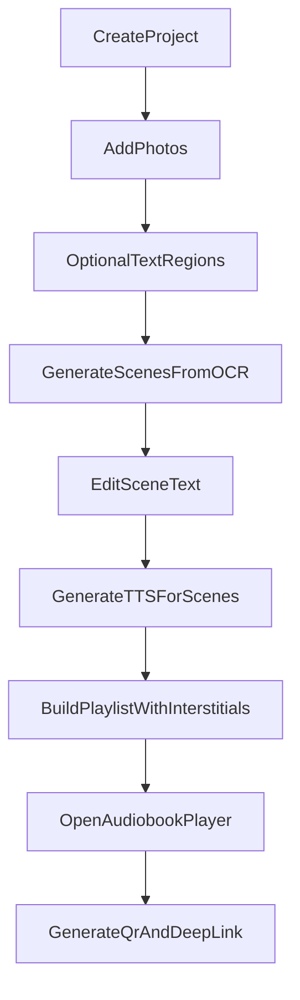

# Specyfikacja MVP aplikacji audiobookowej

**Cel:** Zamknąć spójną specyfikację MVP dla aplikacji `web + iOS + Android` budowanej w `Expo + React Native`, która pozwala tworzyć audiobooki ze zdjęć książek, odtwarzać je jako playlisty scen i udostępniać projekty przez link/QR.

## Uzgodnione założenia
- MVP ma mieć pełną funkcjonalność na `web`, `iOS` i `Android`.
- Użytkownicy mają konta; projekty są prywatne domyślnie.
- Udostępnianie projektu odbywa się tylko po zalogowaniu i tylko dla osób z nadanym dostępem.
- `Text to Speech` ma być realizowane przez `ElevenLabs`.
- MVP wspiera języki `polski` i `angielski`.
- Gotowy audiobook można cache'ować offline w postaci audio.
- Wstawki między stronami są wybierane z listy presetów.

## Rekomendacje produktowe do MVP
- OCR: rekomendowany wariant chmurowy z naciskiem na jakość. Start od `Google Cloud Vision` lub `Google Document AI`; `Azure Document Intelligence` zostawić jako benchmark jakościowy na później.
- Billing: rekomendowany model `subskrypcja miesięczna + roczna` z limitami użycia na poziomie planu. To prostsze wdrożeniowo od hybrydy z kredytami, a nadal zgodne z rynkiem AI/TTS.
- Jednostka limitów dla użytkownika: komunikować limity jako `liczba stron miesięcznie`, a wewnętrznie rozliczać OCR/TTS przez znaki, czas audio i storage.
- Udostępnianie przez QR: QR powinien prowadzić do `deep linku`, który po zalogowaniu otwiera bezpośrednio ekran odtwarzacza konkretnego projektu.

## Definicja MVP
### 1. Konto i dostęp
- Rejestracja, logowanie, reset hasła.
- Lista własnych projektów.
- Udostępnianie projektu wybranym użytkownikom.
- Rola `owner` i `viewer` w MVP; edycję współdzieloną odłożyć na później.

### 2. Zarządzanie projektami
- Tworzenie projektu z polami: `tytuł`, `okładka`, `język`, `głos lektora`, `preset wstawki`.
- Edycja projektu i usuwanie projektu.
- Widok listy projektów i widok szczegółów projektu.

### 3. Dodawanie materiałów
- Dodawanie zdjęć stron z aparatu albo z galerii/biblioteki.
- Kolejność zdjęć musi być edytowalna.
- Dla każdego zdjęcia użytkownik może opcjonalnie zaznaczyć obszary tekstu.
- Jeśli obszary nie są zaznaczone, OCR analizuje całe zdjęcie.

### 4. Przetwarzanie treści
- Kliknięcie `Dalej` po etapie zdjęć tworzy `sceny` odpowiadające zdjęciom.
- Dla każdej sceny zapisujemy: zdjęcie źródłowe, wynik OCR, ewentualne zaznaczone obszary, status przetwarzania.
- Użytkownik może edytować tekst każdej sceny przed generacją audio.
- Drugie kliknięcie `Dalej` uruchamia TTS dla każdej sceny i tworzy playlistę audio.

### 5. Odtwarzacz audiobooka
- Audiobook jest playlistą złożoną z `tracków scen` oraz `tracków wstawek`.
- Odtwarzacz ma `play/pause`, `poprzednia strona`, `następna strona`, pasek postępu i listę scen.
- Nawigacja między stronami działa na poziomie playlisty, nie jednego scalonego pliku audio.
- Cache offline obejmuje wygenerowane tracki audio; zdjęcia mogą pozostać online w MVP.

### 6. Głosy i preview
- Wybór głosu lektora z listy dostępnych głosów ElevenLabs.
- Odsłuch próbki głosu przed wyborem.
- Głos przypisany do projektu, nie do pojedynczej sceny.

### 7. QR i deep linking
- Dla każdego projektu generowany jest QR.
- QR otwiera aplikację bezpośrednio na odtwarzaczu danego projektu.
- Jeśli aplikacja nie jest zainstalowana, link powinien otwierać webowy odpowiednik odtwarzacza po zalogowaniu.

### 8. Cennik
- Osobna zakładka `Cennik`.
- Trzy pakiety: `Free`, `Premium`, `Max`.
- Widok ma porównywać limity i korzyści, a nie tylko cenę.

## Specyfikacja części webowej
### Rola weba w MVP
- Web jest pełnoprawną, zalogowaną aplikacją użytkownika, a nie tylko landing page.
- Web ma wspierać pełne tworzenie, edycję, odtwarzanie i udostępnianie projektów.
- W MVP część webowa nie obejmuje osobnego publicznego serwisu marketingowego ani panelu administracyjnego.

### Główne cele części webowej
- Umożliwić wygodne zarządzanie biblioteką projektów na większym ekranie.
- Zapewnić szybką edycję tekstu po OCR, która na desktopie będzie wygodniejsza niż na mobile.
- Umożliwić tworzenie projektu również bez telefonu, przez upload zdjęć z dysku.
- Zapewnić wygodny player do odsłuchu, nawigacji po scenach i wejścia z linku/QR po zalogowaniu.

### Główne scenariusze użytkownika na webie
- Użytkownik loguje się i przegląda listę swoich projektów.
- Użytkownik tworzy nowy projekt, nadaje tytuł, dodaje okładkę i wybiera głos lektora.
- Użytkownik dodaje zdjęcia stron przez `drag and drop` lub wybór plików z dysku.
- Użytkownik opcjonalnie zaznacza obszary tekstu na zdjęciach.
- Użytkownik przechodzi do listy scen, poprawia tekst OCR i uruchamia generowanie audio.
- Użytkownik odsłuchuje audiobook jako playlistę i przechodzi między stronami.
- Użytkownik generuje QR i udostępnia projekt innej zalogowanej osobie.

### Architektura informacji web app
- `Moje projekty` jako ekran startowy po zalogowaniu.
- `Nowy projekt / Edycja projektu` jako wieloetapowy kreator.
- `Sceny i tekst` jako osobny etap edycyjny z naciskiem na szybkie poprawki OCR.
- `Odtwarzacz projektu` jako osobny ekran lub prawa kolumna w widoku projektu.
- `Udostępnianie` jako sekcja w szczegółach projektu.
- `Cennik i plan` jako zakładka w aplikacji.
- `Konto` jako sekcja ustawień użytkownika.

### Ekrany web MVP
#### 1. Logowanie i konto
- Rejestracja, logowanie, reset hasła.
- Informacja o aktualnym planie i limicie wykorzystania.

#### 2. Lista projektów
- Widok kafelków lub tabeli z okładką, tytułem, statusem i datą modyfikacji.
- Akcje szybkie: `otwórz`, `edytuj`, `odtwórz`, `udostępnij`, `usuń`.
- Filtrowanie po statusie: `draft`, `OCR w toku`, `gotowe do TTS`, `gotowe`.

#### 3. Kreator projektu
- Krok 1: dane projektu: `tytuł`, `okładka`, `język`, `głos`, `preset wstawki`.
- Krok 2: upload zdjęć stron.
- Krok 3: opcjonalne zaznaczanie obszarów tekstu.
- Krok 4: przegląd scen i edycja tekstu OCR.
- Krok 5: generacja audio i przejście do odtwarzacza.

#### 4. Upload i zarządzanie zdjęciami
- Obsługa `drag and drop`, wielokrotnego uploadu i zmiany kolejności zdjęć.
- Miniatury stron z numeracją i stanem przetworzenia.
- Możliwość usunięcia zdjęcia i podmiany pojedynczej strony.
- Walidacja formatu i rozmiaru plików.

#### 5. Edytor obszarów tekstu
- Podgląd zdjęcia z możliwością rysowania prostokątnych obszarów OCR.
- Funkcja opcjonalna; użytkownik może pominąć ten krok.
- Możliwość resetu zaznaczeń i powrotu do pełnego OCR dla całej strony.

#### 6. Edytor scen i tekstu
- Lista scen po lewej i edytor tekstu aktywnej sceny po prawej.
- Podgląd zdjęcia źródłowego przy edytowanej scenie.
- Status sceny: `OCR gotowy`, `wymaga korekty`, `gotowe do audio`, `audio wygenerowane`.
- Akcje: `zapisz`, `przejdź do poprzedniej/następnej sceny`, `wygeneruj audio`.

#### 7. Odtwarzacz projektu
- Odtwarzanie playlisty złożonej z tracków scen i wstawek.
- Widok aktualnej sceny, czasu trwania i postępu całego projektu.
- Przycisk `poprzednia strona` i `następna strona`, które przełączają pozycję playlisty.
- Lista tracków z możliwością skoku do wybranej sceny.

#### 8. Udostępnianie i QR
- Generowanie kodu QR dla projektu.
- Podgląd i pobranie QR do druku lub udostępnienia.
- Zarządzanie dostępem do projektu: dodanie użytkownika, odebranie dostępu, lista osób z dostępem.
- Link z QR powinien prowadzić po zalogowaniu bezpośrednio do odtwarzacza projektu.

#### 9. Cennik i billing
- Zakładka z pakietami `Free`, `Premium`, `Max`.
- Widok wykorzystania limitu stron, storage i aktywnych projektów.
- Możliwość zmiany planu i podglądu historii rozliczeń w późniejszym etapie.

### Funkcje szczególnie ważne na desktopie
- Bardzo szybka edycja tekstu dla wielu scen jedna po drugiej.
- Możliwość pracy na dwóch panelach: `lista scen` + `edytor`.
- Wygodny batch upload wielu zdjęć z dysku.
- Czytelny monitoring statusu przetwarzania OCR i TTS dla większych projektów.

### Różnice web vs mobile w MVP
- Web priorytetyzuje `upload z dysku`, `batch operations` i `szybką edycję tekstu`.
- Mobile priorytetyzuje `robienie zdjęć aparatem`, `dodawanie z galerii` i `odsłuch w ruchu`.
- Logika domenowa i model projektu powinny być wspólne, ale UX i układ ekranów mogą być różne.

### Wymagania niefunkcjonalne dla weba
- Responsywność minimum dla `desktop` i `tablet`; telefoniczny web może być wspierany ograniczenie, ale nie musi być głównym doświadczeniem.
- Bezpieczny upload plików i kontrola dostępu do prywatnych projektów.
- Czytelne stany asynchroniczne dla OCR i TTS: `queued`, `processing`, `done`, `error`.
- Możliwość wznowienia pracy w projekcie bez utraty postępu.

### Poza zakresem web MVP
- Publiczna strona marketingowa z osobnym CMS.
- Panel administratora.
- Publiczny player bez logowania.
- Zaawansowana współedycja w czasie rzeczywistym.

## Rekomendowane pakiety na start
### Free
- 1 aktywny projekt.
- Do 30 stron miesięcznie przetwarzania.
- Ograniczona lista głosów.
- Podstawowe wstawki presetowe.
- QR i współdzielenie tylko dla własnych projektów po zalogowaniu odbiorcy.

### Premium
- Do 10 aktywnych projektów.
- Do 300 stron miesięcznie.
- Szersza biblioteka głosów i preview.
- Priorytetowe przetwarzanie.
- Lepsze limity storage i dłuższy cache offline.

### Max
- Do 50 aktywnych projektów.
- Do 1500 stron miesięcznie lub wysoki fair-use limit.
- Najszersza pula głosów.
- Najwyższy priorytet przetwarzania.
- Przygotowanie pod przyszłe funkcje: synchronizacja zdjęć z audio, zaawansowane udostępnianie, większe storage.

## Model domenowy
- `User`
- `SubscriptionPlan`
- `Project`
- `ProjectShare`
- `PageImage`
- `TextRegion`
- `Scene`
- `VoiceProfile`
- `InterstitialPreset`
- `AudioTrack`
- `PlaylistItem`
- `QrShareLink`

## Główny przepływ użytkownika

## Zakres poza MVP
- Synchronizacja zdjęć z aktualnie czytaną sceną w czasie odtwarzania.
- Współedycja projektu przez wiele osób jednocześnie.
- Upload własnych plików audio jako wstawek.
- Klonowanie głosów i zaawansowana personalizacja TTS.
- Zaawansowany export do formatów typu `m4b`.

## Krytyczne decyzje architektoniczne na kolejny etap
- Ujednolicony backend dla `auth`, `projects`, `OCR jobs`, `TTS jobs`, `sharing`, `billing` i `deep links`.
- Asynchroniczne kolejki do OCR i TTS, bo generacja będzie trwała dłużej niż zwykłe requesty UI.
- Storage rozdzielony na `obrazy`, `tekst OCR`, `tracki audio`, `okładki`.
- Jeden wspólny model playlisty wykorzystywany przez web i mobile.

## Rezultat tego etapu
- Gotowa, spójna specyfikacja MVP.
- Zamknięte najważniejsze decyzje produktowe i biznesowe.
- Dobre wejście do kolejnego kroku: `architektura systemu`, `user stories`, `makiety`, albo `scaffold projektu Expo + backend`.
